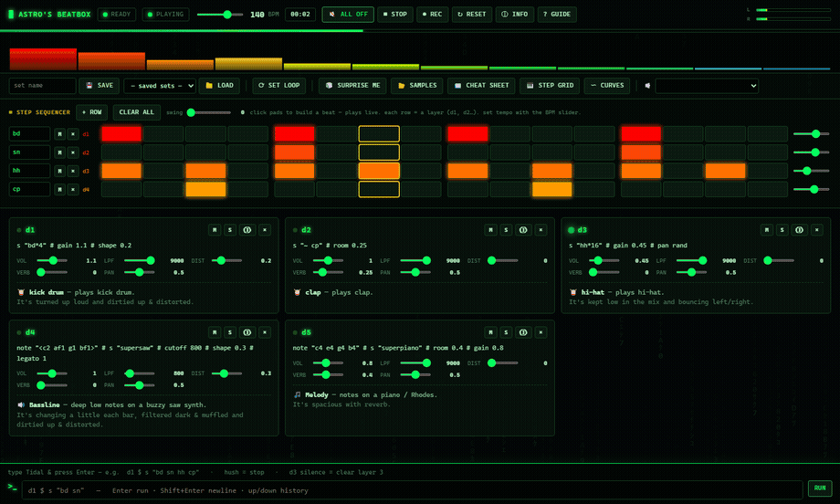
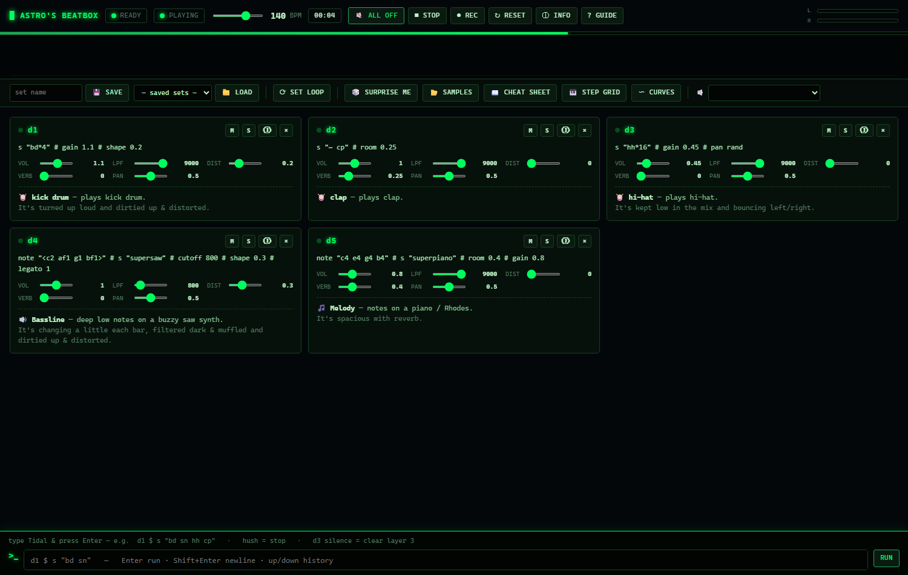
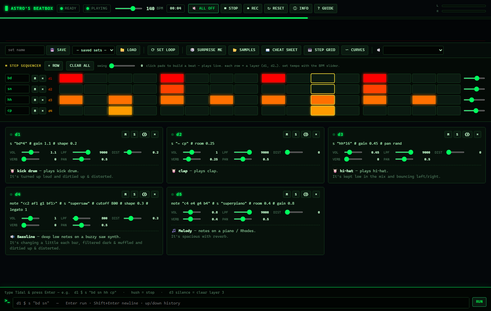
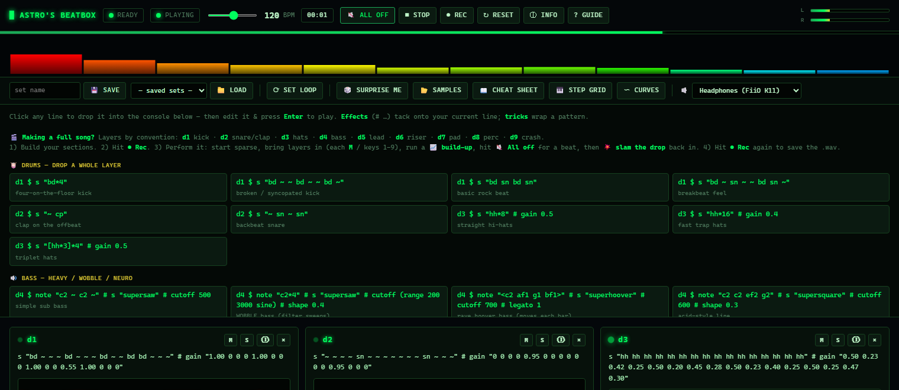

# Astro's Beatbox 🎛️

A free, **code-first live-coding music rig** for Windows — describe a beat in plain English (or click it out) and it's playing in seconds, no DAW required.

**Stack:** [TidalCycles](https://tidalcycles.org/) (pattern language) → [SuperCollider](https://supercollider.github.io/) / SuperDirt (synthesis) → WASAPI audio, driven headless by a custom **MCP server** (TypeScript) with a Matrix-themed **web dashboard**.

> **Platform:** Windows 10/11 only (uses WASAPI + PowerShell helpers).

---

## Screenshots



| Live dashboard | Step sequencer (channel rack) |
|---|---|
|  |  |

Each instrument gets its own wavelength colour. Built-in cheat sheet — clickable Tidal snippets, genre starters, build-ups & drops:



---

## Features

- Live `d1`–`d16` layer cards with code, plain-English explanations, and per-layer knobs
- Real-time L/R meter + **wavelength-coloured spectrum** (low freq red → high freq blue)
- **Step sequencer** (channel rack) with per-instrument wavelength colours + swing
- **Per-channel modulation curves** — draw an automation/LFO curve per layer
- **Sample browser**, **save/load sets**, **record-to-WAV**
- **Audio-device switcher** (speakers ↔ headphones, live)
- **Set Loop** — freeze the current beat into one `LOOP_` channel and build on top
- Loop-progress bar + track timer, keyboard shortcuts, built-in cheat sheet, "Surprise me"

---

## Prerequisites

Install these once (all free):

1. **SuperCollider 3.13+** — <https://supercollider.github.io/downloads>
2. **SuperCollider quarks** — open the SuperCollider IDE and run:
   ```supercollider
   Quarks.install("SuperDirt");   // also pulls Vowel + Dirt-Samples
   Quarks.install("Vowel");
   ```
   Then install **sc3-plugins** (extra UGens): <https://supercollider.github.io/sc3-plugins/>
   (drop into `%LOCALAPPDATA%\SuperCollider\Extensions`). Recompile the class library afterward.
3. **GHCup → GHC + cabal** — <https://www.haskell.org/ghcup/> (Windows installer; include the MSYS2/mingw toolchain)
4. **TidalCycles 1.10** — once cabal is on PATH:
   ```sh
   cabal update
   cabal install tidal --lib
   ```
5. **Node.js 18+** — <https://nodejs.org/>

---

## Install & build

```sh
git clone https://github.com/astrobyte-dev/astros-beatbox.git
cd astros-beatbox/mcp
npm install
npm run build
```

### Paths
Paths now **auto-detect**: the project root resolves from the repo, `sclang.exe` is found
under `C:\Program Files\SuperCollider-*`, GHCup defaults to `C:\ghcup`, and Dirt-Samples uses
`%LOCALAPPDATA%`. If your installs live elsewhere, override with environment variables:

| Variable | Default | What |
|---|---|---|
| `TIDAL_HOME` | repo root | project folder |
| `TIDAL_SCLANG` | newest `SuperCollider-*` in Program Files | path to `sclang.exe` |
| `TIDAL_GHCUP` | `C:\ghcup` | GHCup base dir |
| `CABAL_DIR` | `C:\cabal` | cabal store |
| `TIDAL_DIRT_SAMPLES` | `%LOCALAPPDATA%\SuperCollider\downloaded-quarks\Dirt-Samples` | sample library |
| `TIDAL_AUDIO_DEVICE` | OS default | startup audio device |
| `TIDAL_DASH_PORT` | `3737` | dashboard port |

---

## Run

Register the MCP server with an MCP client (Claude Code / Claude Desktop). A ready-made
example is in [`.mcp.json.example`](.mcp.json.example) — copy it to `.mcp.json` and set the
absolute path to `mcp/dist/server.js`. Then:

1. Call the **`boot`** tool (first boot ~30–40s while SuperDirt loads samples).
2. Open the dashboard at **<http://127.0.0.1:3737>**.
3. Type a beat in the console, click **Surprise me**, or open the **Step grid**.
4. For reliable audio, pick a **`Windows WASAPI : <your output>`** device from the 🔈 dropdown.

### MCP tools
`boot` · `eval_tidal {code}` · `hush` · `eval_sc {code}` · `status`

```haskell
-- example: paste into the dashboard console (or eval_tidal)
do { setcps (140/60/4)
   ; d1 $ s "bd*4" # gain 1.1
   ; d2 $ s "~ cp" # room 0.2
   ; d3 $ s "hh*16" # gain 0.4 # pan rand
   ; d4 $ note "<c2 af1 g1 bf1>" # s "supersaw" # cutoff 600 # legato 1 }
```

> ⚠️ Run the server in **one** client at a time — two instances fight over the audio engine
> and port 3737.

See [CONTRIBUTING.md](CONTRIBUTING.md) for the dev workflow and project layout.

---
🤖 Built collaboratively with [Claude Code](https://claude.com/claude-code).
