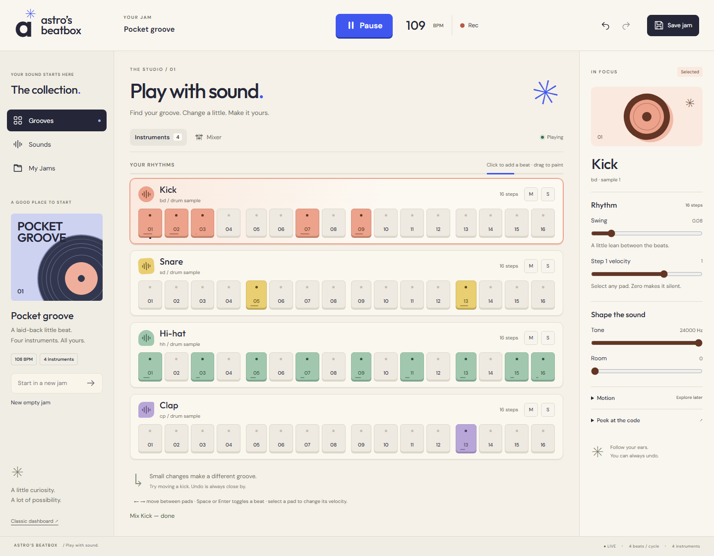
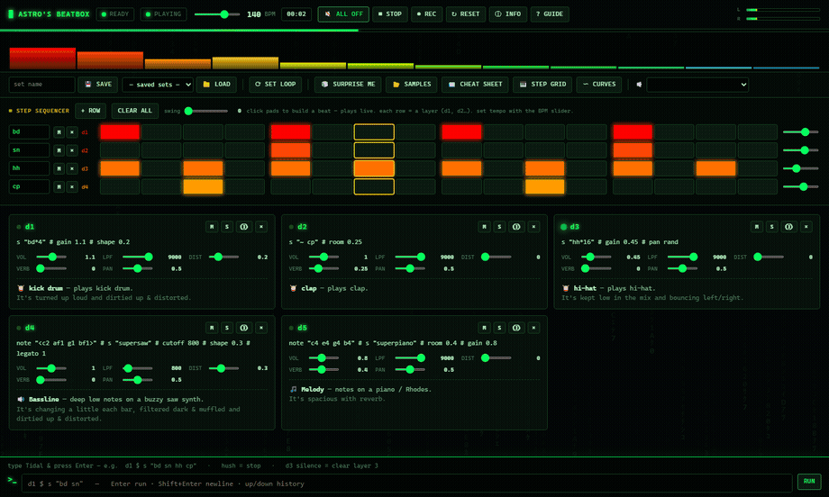
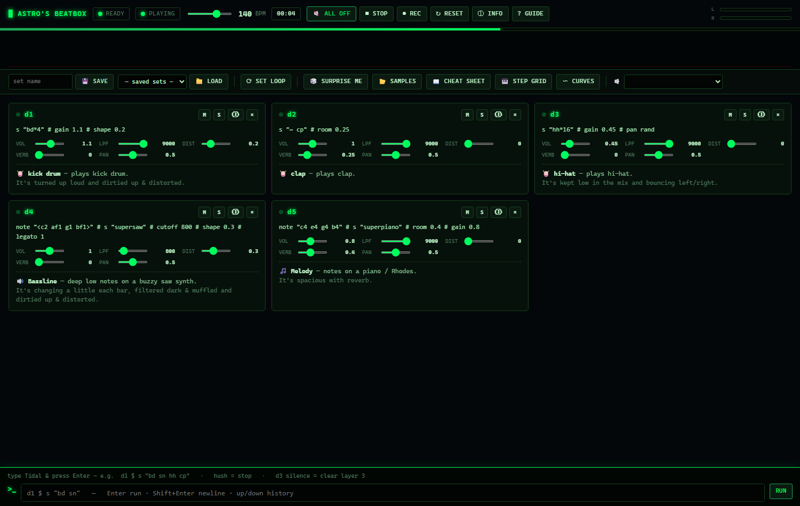
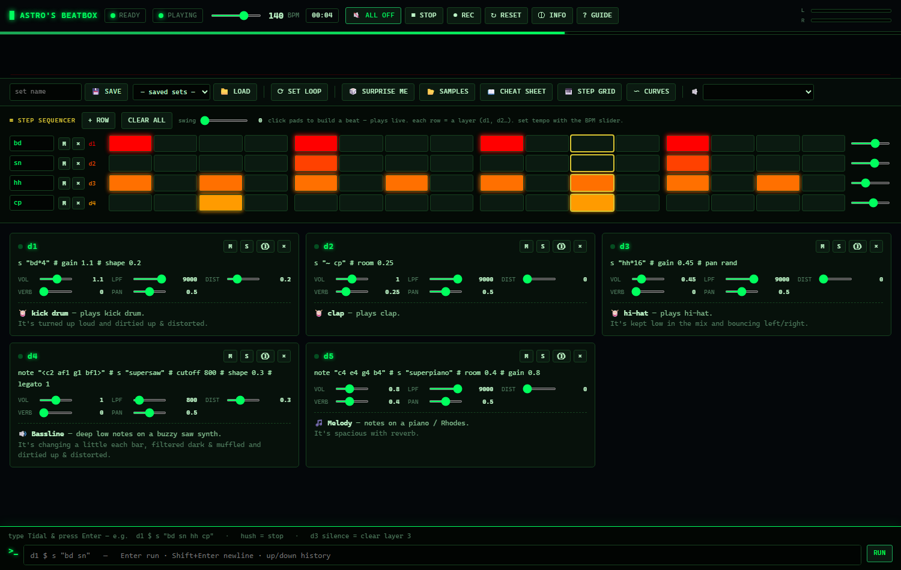
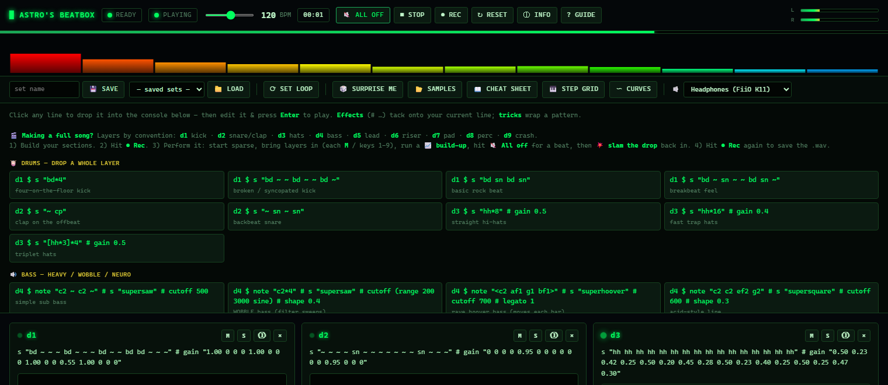

# Astro's Beatbox 🎛️

A free musical playground for Windows. **Play with sound.** Start a groove, change a rhythm, and keep what you like. The original live-coding dashboard remains available for deeper Tidal workflows.

**Stack:** React + TypeScript + Vite studio → shared TypeScript project/MCP service → [TidalCycles](https://tidalcycles.org/) → [SuperCollider](https://supercollider.github.io/) / SuperDirt → WASAPI audio. Both interfaces share one recoverable project.

> **Platform:** Windows 10/11 only (uses WASAPI + PowerShell helpers).

---

## Screenshots



The instrument studio lives at `/studio`. The screenshots below show the retained classic dashboard at `/`.



| Live dashboard | Step sequencer |
|---|---|
|  |  |

Each instrument gets its own wavelength colour and a **live waveform of its own audio**. Built-in cheat sheet — clickable Tidal snippets, genre starters, build-ups & drops:



---

## Features

- **Studio:** named instruments, keyboard-accessible rhythm pads, painting, velocity, swing, contextual effects, independent mixing, generated code inspection, shared Undo/Redo, complete Save and My Jams.
- **One curated starter:** Pocket groove, with kick, snare, hi-hat and clap. Browse and audition installed sound banks in Sounds, then Replace the selected visual instrument.
- The following deeper tools remain available in the **classic dashboard**:
- **Live layer cards** (`d1`–`d16`) — each shows its code, a plain-English explanation, per-layer knobs, and a **live waveform of that channel's own audio**
- **Per-channel oscilloscope** — every card draws a real, phase-locked waveform tapped from its own voice; plus a master L/R meter and a **wavelength-coloured spectrum** (low freq red → high freq blue)
- **Mixer view** with all 12 channels as strips: a volume fader, pan, reverb + delay sends, mute/solo, a meter, and a live mini-scope each
- **Step sequencer** with **per-step velocity** (scroll a pad), **drag-to-paint** + right-click erase, swing, and a playhead **locked to the audio** so each lit step flashes exactly when you hear it
- **Pattern slots (A/B/C/D)** you can chain into a song that advances each bar
- **Drag-and-drop sample browser** — drag a sound onto a channel to swap it; drag channels to reorder
- **Per-channel modulation curves** — draw an automation/LFO curve per layer
- **Save / load sets**, **record-to-WAV**, live **audio-device switcher** (speakers ↔ headphones)
- **Set Loop** — freeze the current beat into one `LOOP_` channel and build on top
- Loop-progress bar, track timer, keyboard shortcuts, built-in cheat sheet, "Surprise me"

---

## Prerequisites

Install these once (all free):

1. **SuperCollider 3.13+** — <https://supercollider.github.io/downloads>
2. **SuperCollider quarks** — open the SuperCollider IDE and run:
   ```supercollider
   Quarks.install("SuperDirt");   // also pulls Vowel + Dirt-Samples
   Quarks.install("Vowel");
   ```
   Then install **sc3-plugins** (extra UGens): <https://supercollider.github.io/sc3-plugins/>
   (drop into `%LOCALAPPDATA%\SuperCollider\Extensions`). Recompile the class library afterward.
3. **GHCup → GHC + cabal** — <https://www.haskell.org/ghcup/> (Windows installer; include the MSYS2/mingw toolchain)
4. **TidalCycles 1.10** — once cabal is on PATH:
   ```sh
   cabal update
   cabal install tidal --lib
   ```
5. **Node.js 24.14.0 and npm 11.9.0** — <https://nodejs.org/>. Pinned in `.nvmrc`, package metadata and CI.

---

## Install & build

```sh
git clone https://github.com/astrobyte-dev/astros-beatbox.git
cd astros-beatbox/mcp
npm ci
npm run build
```

### Paths
Paths now **auto-detect**: the project root resolves from the repo, `sclang.exe` is found
under `C:\Program Files\SuperCollider-*`, GHCup defaults to `C:\ghcup`, and Dirt-Samples uses
`%LOCALAPPDATA%`. If your installs live elsewhere, override with environment variables:

| Variable | Default | What |
|---|---|---|
| `TIDAL_HOME` | repo root | project folder |
| `TIDAL_SCLANG` | newest `SuperCollider-*` in Program Files | path to `sclang.exe` |
| `TIDAL_GHCUP` | `C:\ghcup` | GHCup base dir |
| `CABAL_DIR` | `C:\cabal` | cabal store |
| `TIDAL_DIRT_SAMPLES` | `%LOCALAPPDATA%\SuperCollider\downloaded-quarks\Dirt-Samples` | sample library |
| `TIDAL_AUDIO_DEVICE` | OS default | startup audio device |
| `TIDAL_DASH_PORT` | `3737` | dashboard port |
| `TIDAL_RECORDINGS_DIR` | `recordings/` | application recording files and catalogue |

---

## Run

Register the MCP server with an MCP client (Claude Code / Claude Desktop). A ready-made
example is in [`.mcp.json.example`](.mcp.json.example) — copy it to `.mcp.json` and set the
absolute path to `mcp/dist/server.js`. Then:

1. Call the **`boot`** tool (first boot ~30–40s while SuperDirt loads samples).
2. Open the dashboard at **<http://127.0.0.1:3737>**.
3. Type a beat in the console, click **Surprise me**, or open the **Step grid**.
4. For reliable audio, pick a **`Windows WASAPI : <your output>`** device from the 🔈 dropdown.

For the new instrument experience, open **<http://127.0.0.1:3737/studio>**.
Use **Start Pocket groove → Play → edit a pad → Sounds → Preview → Replace →
Undo → Save jam**. Reopen it from **My Jams**, then **Record → Finish**. Completed
takes appear in **Recordings**, with playback and Download WAV.
Play prepares the engine if needed. Existing projects open as they are;
the starter is offered only for an empty project. The built studio is served by the
same application; no separate production frontend server is needed.

See [the P2 implementation and validation report](docs/p2-creative-loop.md) for
asset identity, preview routing, recording lifecycle, runtime ownership and the
completed exit criteria, including real Windows audio and reconnect measurements.
The [P1 report](docs/p1-studio.md) records the prior milestone.

### MCP tools
`boot` · `eval_tidal` · `hush` · `eval_sc` · `status` · `project_status` ·
`project_edit` · `project_undo` · `project_redo` · `project_save` · `project_load` ·
`project_new` · `project_recover`

For musical commands, read `status` and send `projectId: project.id` and
`revision: project.revision`. Stale edits fail explicitly. `project_edit` accepts
an `edits` array and a `label`; the whole batch is one undo intention shared with
the dashboard. The console and legacy tool names remain available for raw Tidal.

```haskell
-- example: paste into the dashboard console (or eval_tidal)
do { setcps (140/60/4)
   ; d1 $ s "bd*4" # gain 1.1
   ; d2 $ s "~ cp" # room 0.2
   ; d3 $ s "hh*16" # gain 0.4 # pan rand
   ; d4 $ note "<c2 af1 g1 bf1>" # s "supersaw" # cutoff 600 # legato 1 }
```

The registered `mcp/dist/server.js` entry now connects to a persistent local
runtime. Multiple MCP clients and browser tabs share it; closing a client keeps
music and recording running. Use `npm run runtime:stop` in `mcp` to explicitly
finalize an active take and release the owned engines. After backend changes,
stop the runtime, rebuild, then reconnect. Incompatible services on occupied
ports are never replaced. `TIDAL_DASH_PORT=0` explicitly selects an ephemeral
instance for isolated tests; that instance closes with its MCP client.

> 🔒 **Security:** live coding *is* arbitrary code execution — `eval_tidal`/`eval_sc` and the
> dashboard's `/cmd` run whatever you send, and on Windows SuperCollider can touch the
> filesystem/shell. The dashboard binds to `127.0.0.1` and rejects non-loopback (`Host`)
> and cross-origin (`Origin`) requests to block DNS-rebinding/CSRF from a browser tab —
> but still **don't expose port 3737 to an untrusted network**.

See [CONTRIBUTING.md](CONTRIBUTING.md) for the dev workflow and project layout.

---
🤖 Built collaboratively with [Claude Code](https://claude.com/claude-code).

## Command reliability (P0a)

Dashboard and MCP commands now share validation and framed interpreter results.
Stop keeps tracked patterns, tempo and mute/solo choices; Play resumes them. Explicit
Tidal hush still clears patterns. Occupied ports fail safely without process takeover.

See
[the P0a command contract and validation notes](docs/p0a-command-boundary.md) for
acknowledgement levels, retries, ownership, recovery limits and test commands.

## Recoverable musical projects (P0b)

The existing dashboard now edits a server-owned project. Use **Step grid → + Row**
to create a visual track, enter its sound name and paint its pads. Mixer level and
stereo balance act on a persistent audio channel; velocities and effects remain
musical data. **Undo/Redo** includes browser and MCP project edits.

**Save project/Open project** uses versioned `projects/*.abx.json` files containing
all tracks, clips, scenes, automation, arrangement, assets and dependencies.
**Export/Import .tidal** remains a separate source workflow. Imported code stays
opaque; rhythm/effect controls require visual clips rather than rewriting code.

Every acknowledged musical edit writes a checksummed recovery checkpoint under
`.abx-recovery/`. Restart restores the authored document stopped, without booting
audio or replaying an execution log. Press Play explicitly to resume. Missing
samples remain identified and are silenced rather than substituted.

Read [the P0b architecture, compatibility and validation report](docs/p0b-project-model.md)
for the schema, edit API, recovery limits, routing and exit criteria. That report records the completed P0b milestone; the current `/studio` extends it.
