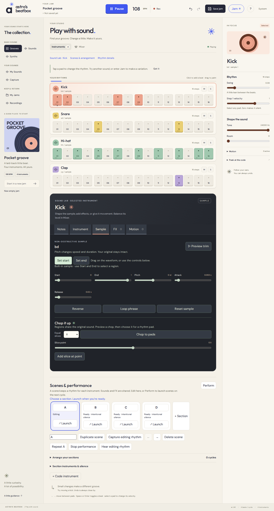

# Astro's Beatbox 🎛️

**Play with sound.** Start a groove, change a rhythm, explore an instrument and
keep what you like. Astro's Beatbox is a local music playground with Studio, Jam,
Sound Lab, sampling, scenes and performance recording.

[Start here: the user guide](docs/user-guide.md) ·
[Installation](#prerequisites) · [Development handoff](HANDOFF.md)

Open **Studio → Start Playing** for a four-instrument Pocket groove. Tap a pad,
try another sound or enter **Jam ✳** to make a variation. Save status stays beside
your project name. **?** opens a short guide and keyboard shortcuts.



## Make it yours

- **Studio:** tactile rhythm pads, velocity, swing, independent channel mixing and shared Undo/Redo.
- **Sound Lab:** synth patches, sample shaping, serial effects and modulation; basic controls first, depth available.
- **My Sounds / Capture:** import WAVs, record an input, keep a sample, trim, reverse, loop and chop without changing originals.
- **Jam:** protect favorite parts, make bounded variations, compare ideas, move macros and promote rhythms to scenes.
- **Scenes / Perform:** independent rhythms, arrangement repeats, queued scene launches and engine-reported position.
- **My Jams / Recordings:** complete project saves, stopped reopen, recovery checkpoints and finalized WAV recordings.
- **System:** local readiness, processes, ports and logs, owned audio restart/stop and clean Quit.

The collection separates built-in samples, synths, personal sounds, saved jams and
recordings. Capture's **Keep as Sample → Use this sound** takes you to My Sounds.
The user guide explains the limits: scenes share instrument/FX settings; Jam ideas
are session alternatives; imported files need the managed audio directory when
moving projects; macros apply on release; loops do not time-stretch audio.

## Platform and development status

Windows is the historical native audio baseline. Current P5 development runs on
Ubuntu 24.04.4 LTS with **Level B — Runtime Safe** validation. Native Linux audio
and microphone behavior remain unvalidated. Real Windows revalidation remains
pending for all stacked development phases; browser/CI results do not establish
native timing, CPU, musical quality or desktop acceptance.

P5 is intentionally stacked on P4. See the [Product Finish audit](docs/p5-product-audit.md),
[completion report](docs/p5-product-finish.md) and [validation evidence](docs/p5-validation.json).
The prior contracts remain in [Jam](docs/p4-jam-exploration.md),
[Sampling](docs/p35b-capture-sampling.md), [Sound Lab](docs/p35-sound-lab-core.md),
[Composition](docs/p3-composition-performance.md) and [Ubuntu setup](docs/p26-ubuntu-portability.md).

## Compatibility and architecture

Studio is at `/studio`; System is at `/system`. The classic dashboard remains at
`/`, linked under System's **Compatibility tools**, for raw Tidal code, source
import/export, output-device selection and legacy routing. These capabilities do
not yet have complete Studio parity. See the [capability comparison](docs/p5-product-audit.md#classic-capability-decision-before-implementation).

React + TypeScript + Vite → one TypeScript project/runtime service →
[TidalCycles](https://tidalcycles.org/) → [SuperCollider](https://supercollider.github.io/)
/ SuperDirt. Studio, classic and MCP use the same recoverable musical document.
No accounts, tracking or cloud service is required. Developer contracts and phase
history are separate from the [user guide](docs/user-guide.md).

## Prerequisites

These are the proven Windows prerequisites. Ubuntu development and the proposed
native-audio setup are documented separately in [P2.6](docs/p26-ubuntu-portability.md).

Install these once (all free):

1. **SuperCollider 3.13+** — <https://supercollider.github.io/downloads>
2. **SuperCollider quarks** — open the SuperCollider IDE and run:
   ```supercollider
   Quarks.install("SuperDirt");   // also pulls Vowel + Dirt-Samples
   Quarks.install("Vowel");
   ```
   Then install **sc3-plugins** (extra UGens): <https://supercollider.github.io/sc3-plugins/>
   (drop into `%LOCALAPPDATA%\SuperCollider\Extensions`). Recompile the class library afterward.
3. **GHCup → GHC + cabal** — <https://www.haskell.org/ghcup/> (Windows installer; include the MSYS2/mingw toolchain)
4. **TidalCycles 1.10** — once cabal is on PATH:
   ```sh
   cabal update
   cabal install tidal --lib
   ```
5. **Node.js 24.14.0 and npm 11.9.0** — <https://nodejs.org/>. Pinned in `.nvmrc`, package metadata and CI.

---

## Install & build

```sh
git clone https://github.com/astrobyte-dev/astros-beatbox.git
cd astros-beatbox/mcp
npm ci
npm run build
```

After building, double-click **Launch Beatbox.vbs** in the project folder on Windows.
It starts the existing persistent runtime headlessly and opens Studio. If Beatbox
is already running, it opens that instance and says so. The **System** link in
Studio leads to audio controls, process/port inspection and **Quit Astro’s Beatbox**.
An unrelated port owner is reported and left running. `npm run launch` in `mcp`
is the equivalent command for an already-open developer terminal.

**Stop audio** keeps the jam but releases owned audio processes. **Restart audio**
prepares them again and restores the prior transport state. **Restart services**
also restarts telemetry while the persistent owner and HTTP connection stay in
place. **Quit** finalizes recording, stops owned audio, closes telemetry/HTTP, and
exits the owner. If cleanup fails, System stays available and reports the failure.
Closing a browser or MCP connection continues to leave music and recording running.

Developer diagnostics in System reveals captured interpreter output without
opening consoles. See the [P2.5 implementation and validation report](docs/p25-runtime-control-center.md).

### Paths
The defaults below describe Windows and remain unchanged there. Linux uses
native executable discovery and workspace-specific XDG storage; see the complete
[Linux environment table](docs/p26-ubuntu-portability.md#configuration-and-local-state).
The backend reads externally supplied environment variables; it does not load `.env` files.

Paths now **auto-detect**: the project root resolves from the repo, `sclang.exe` is found
under `C:\Program Files\SuperCollider-*`, GHCup defaults to `C:\ghcup`, and Dirt-Samples uses
`%LOCALAPPDATA%`. If your installs live elsewhere, override with environment variables:

| Variable | Default | What |
|---|---|---|
| `TIDAL_HOME` | repo root | project folder |
| `TIDAL_SCLANG` | newest `SuperCollider-*` in Program Files | path to `sclang.exe` |
| `TIDAL_GHCUP` | `C:\ghcup` | GHCup base dir |
| `CABAL_DIR` | `C:\cabal` | cabal store |
| `TIDAL_DIRT_SAMPLES` | `%LOCALAPPDATA%\SuperCollider\downloaded-quarks\Dirt-Samples` | sample library |
| `TIDAL_AUDIO_DEVICE` | OS default | startup audio device |
| `TIDAL_DASH_PORT` | `3737` | dashboard port |
| `TIDAL_RECORDINGS_DIR` | `recordings/` | application recording files and catalogue |

---

## Run

Register the MCP server with an MCP client (Claude Code / Claude Desktop). A ready-made
example is in [`.mcp.json.example`](.mcp.json.example) — copy it to `.mcp.json` and set the
absolute path to `mcp/dist/server.js`. Then:

1. Call the **`boot`** tool (first boot ~30–40s while SuperDirt loads samples).
2. Open the dashboard at **<http://127.0.0.1:3737>**.
3. Type a beat in the console, click **Surprise me**, or open the **Step grid**.
4. For reliable audio, pick a **`Windows WASAPI : <your output>`** device from the 🔈 dropdown.

For the new instrument experience, open **<http://127.0.0.1:3737/studio>**.
Use **Start Pocket groove → Play → edit a pad → Sounds → Preview → Replace →
Undo → Save jam**. Reopen it from **My Jams**, then **Record → Finish**. Completed
takes appear in **Recordings**, with playback and Download WAV.
Play prepares the engine if needed. Existing projects open as they are;
the starter is offered only for an empty project. The built studio is served by the
same application; no separate production frontend server is needed.

See [the P2 implementation and validation report](docs/p2-creative-loop.md) for
asset identity, preview routing, recording lifecycle, runtime ownership and the
completed exit criteria, including real Windows audio and reconnect measurements.
The [P1 report](docs/p1-studio.md) records the prior milestone.

### MCP tools
`boot` · `eval_tidal` · `hush` · `eval_sc` · `status` · `project_status` ·
`project_edit` · `project_undo` · `project_redo` · `project_save` · `project_load` ·
`project_new` · `project_recover`

For musical commands, read `status` and send `projectId: project.id` and
`revision: project.revision`. Stale edits fail explicitly. `project_edit` accepts
an `edits` array and a `label`; the whole batch is one undo intention shared with
the dashboard. The console and legacy tool names remain available for raw Tidal.

```haskell
-- example: paste into the dashboard console (or eval_tidal)
do { setcps (140/60/4)
   ; d1 $ s "bd*4" # gain 1.1
   ; d2 $ s "~ cp" # room 0.2
   ; d3 $ s "hh*16" # gain 0.4 # pan rand
   ; d4 $ note "<c2 af1 g1 bf1>" # s "supersaw" # cutoff 600 # legato 1 }
```

The registered `mcp/dist/server.js` entry now connects to a persistent local
runtime. Multiple MCP clients and browser tabs share it; closing a client keeps
music and recording running. Use `npm run runtime:stop` in `mcp` to explicitly
finalize an active take and release the owned engines. After backend changes,
stop the runtime, rebuild, then reconnect. Incompatible services on occupied
ports are never replaced. `TIDAL_DASH_PORT=0` explicitly selects an ephemeral
instance for isolated tests; that instance closes with its MCP client.

> 🔒 **Security:** live coding *is* arbitrary code execution — `eval_tidal`/`eval_sc` and the
> dashboard's `/cmd` run whatever you send, and on Windows SuperCollider can touch the
> filesystem/shell. The dashboard binds to `127.0.0.1` and rejects non-loopback (`Host`)
> and cross-origin (`Origin`) requests to block DNS-rebinding/CSRF from a browser tab —
> but still **don't expose port 3737 to an untrusted network**.

See [CONTRIBUTING.md](CONTRIBUTING.md) for the dev workflow and project layout.

---
🤖 Built collaboratively with [Claude Code](https://claude.com/claude-code).

## Command reliability (P0a)

Dashboard and MCP commands now share validation and framed interpreter results.
Stop keeps tracked patterns, tempo and mute/solo choices; Play resumes them. Explicit
Tidal hush still clears patterns. Occupied ports fail safely without process takeover.

See
[the P0a command contract and validation notes](docs/p0a-command-boundary.md) for
acknowledgement levels, retries, ownership, recovery limits and test commands.

## Recoverable musical projects (P0b)

The existing dashboard now edits a server-owned project. Use **Step grid → + Row**
to create a visual track, enter its sound name and paint its pads. Mixer level and
stereo balance act on a persistent audio channel; velocities and effects remain
musical data. **Undo/Redo** includes browser and MCP project edits.

**Save project/Open project** uses versioned `projects/*.abx.json` files containing
all tracks, clips, scenes, automation, arrangement, assets and dependencies.
**Export/Import .tidal** remains a separate source workflow. Imported code stays
opaque; rhythm/effect controls require visual clips rather than rewriting code.

Every acknowledged musical edit writes a checksummed recovery checkpoint under
`.abx-recovery/`. Restart restores the authored document stopped, without booting
audio or replaying an execution log. Press Play explicitly to resume. Missing
samples remain identified and are silenced rather than substituted.

Read [the P0b architecture, compatibility and validation report](docs/p0b-project-model.md)
for the schema, edit API, recovery limits, routing and exit criteria. That report records the completed P0b milestone; the current `/studio` extends it.

## P3 composition development

The stacked P3 branch adds Studio scenes, engine-clocked performance, scene
arrangements, canonical motion controls and managed-code drafts. See the
[P3 implementation report](docs/p3-composition-performance.md) for commands,
editing/playback boundaries and validation. Native audio timing and Windows
acceptance remain pending. P2.6 remains Level B — Ubuntu Runtime Safe, draft PR #4,
unmerged; this work does not close its Windows gate or begin Sound Lab.

## Sound Lab development — P3.5A

Studio's **Synths** collection adds Dirty Mono, 808 Sub, Reese, Prism and Static
Bloom. Select a track to edit notes, shape its instrument, build a serial FX rack
and add engine-owned motion. Knobs support drag, fine adjustment, keyboard and
reset. Patches, effects and motion are part of your saved jam and Undo history.

See [Sound Lab architecture, validation and limitations](docs/p35-sound-lab-core.md).
`npm run selftest:p35` validates the production Studio and real MCP/project paths
with a deterministic audio fixture. Native synth/FX audio, CPU and Windows
acceptance remain pending; do not infer them from the portable suite or CI.
