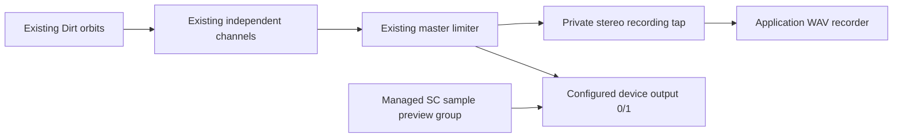

# P2 — Complete the first creative loop

Implementation against clean P1 commit `718027d`. P0a/P0b/P1 baseline was
inspected before edits: **107 tests passed, zero failed/skipped; build and both
server/frontend type checks passed**. This change is P2 only.

**Status: P2 complete, validated on Windows on 6 September 2026.** All 124
automated tests, build/type checks, classic/P1/P2 browser journeys, P0a/P0b/P1
live regressions, actual preview/recording isolation and persistent-runtime
reconnect checks passed. P3 has not begun.

The first live attempt correctly refused occupied ports. The user explicitly
stopped the older rigs before validation continued; application startup never
took over another process or port.

## Boundaries

| Component | Responsibility |
| --- | --- |
| `project.ts`, `project-service.ts`, compiler/storage | Existing canonical authored document, identity, revisions, history and recovery |
| `sound-library.ts` | Installed sample enumeration, bank labels, filename/content identity and dependency resolution |
| `preview.ts` | Serialized, bounded audition through the managed SC engine; no Tidal edits or project history |
| `recordings.ts` | Independent durable take catalogue, finalized WAV validation, integrity checks and retrieval |
| `application.ts` | Existing command queue and deduplication, structured replacement, recording transitions and engine acknowledgements |
| `runtime.ts` | Persistent owner of the application, HTTP service, meter and engine pair |
| `runtime-client.ts`, `server.ts` | Runtime discovery/start and compatible MCP stdio adapter |
| `runtime-control.ts` | Explicit, identity-checked graceful runtime stop |
| Studio `SoundLibrary.tsx`, `Recordings.tsx` | Disposable library browsing/selection and recording playback/download UI |

The P0b reducer, compiler architecture, storage transaction and shared history are
retained. `sound.replace` prepares `asset.put` + `sound.set` as one intention and
uses the existing acknowledged project application/commit path. It changes only
the selected visual clip's asset reference. Steps, velocities, swing, parameters,
automation, mixer settings, other clips and track identity remain intact. Opaque
code clips and stale revisions are rejected before mutation. Replace also ends
an active preview so the result can be heard in the groove.

## Sample identity

The version-1 asset schema accepts optional `source` metadata:

```json
{
  "id": "immutable-project-asset-id",
  "kind": "sample",
  "name": "sd",
  "reference": "sd",
  "index": 1,
  "source": {
    "library": "Dirt-Samples",
    "origin": "bundled",
    "file": "sd/filename.wav",
    "sha256": "64 lowercase hexadecimal characters"
  }
}
```

New studio replacements receive this metadata from the server. The saved identity
does not depend on the readable label or on a fixed index alone. Resolution finds
the exact file within its bank and checks its content hash. Reordering files may
change the runtime index without changing the authored asset. Missing files,
changed contents and unknown library identities remain explicitly missing and
are silenced by the existing safe compiler projection. No similarly named sample
is substituted. The engine captures the library at boot; a library change that
invalidates loaded buffer ordering requires Reset. Before projecting a pinned
sample, the actual SC buffer path/frame availability must also acknowledge.

Existing P0b/P1 files retain their original bank/index references and remain
readable; this is not a bulk migration of old assets. `file` references and the
schema's external-origin distinction remain retained dependencies, not a new
custom sample registration/import system. P2's browser lists the configured
Dirt-Samples library only. Unregistered external files still cannot silently play
a built-in sound with the same name.

The configured directory is now injected into SuperDirt startup as well as used
by the catalogue. Enumeration matches the installed `DirtSoundLibrary.sc`:
lexicographic filenames and WAV/AIF/AIFF/AIFC support. The old FLAC availability
claim was removed because this installed loader does not load FLAC. Readable
aliases are limited to familiar existing bank names such as bd/sd/hh/cp; other
banks keep their original names and filenames. No genre/timbre metadata is invented.

## Preview routing



The private tap copies the composition's output after its limiter and before the
preview group executes. Application DiskOut reads that private bus. Audition
synths execute after the tap, read the actual loaded mono/stereo sample buffer,
and output on the same engine/device bus. They have their own limiter and a short
fade. Another Preview gates the old group, waits for the 20 ms release and clears
it before starting the next sound. Samples play once, capped at five seconds.
The server serializes preview/record/project commands and checks generations.

Preview never calls Tidal, changes the authored project, adds history, or changes
transport. Idle audition prepares the same engine. Missing/unloaded samples,
degraded engines and stale generations return failures; UI status does not
invent successful playback. Mono is duplicated to stereo for audition; stereo
files retain both channels. Preview is dry, without the selected track's effects.

The live script simultaneously captured output bus 0 after audition and the
application's pre-preview recording tap while the composition was paused.
Rapid switching between mono kick and stereo snare samples produced output peak
21,299 and application-recording peak/RMS exactly zero. It also recorded a
nonzero complete groove while Preview was used. This measures the real engine's
output bus on the configured device; it is not an acoustic microphone capture.

## Studio experience

Select a visual instrument, open **Sounds**, choose a bank or search filenames,
then click a row explicitly labelled **Preview**. A separate **Replace Snare**
(or the selected instrument's name) button commits the sound. The selected lane,
right inspector and coloured target label stay anchored while browsing. The
sample list scrolls within the sidebar; there is no replacement modal. Keyboard
controls are native buttons, search and select fields. Undo/Redo use the existing
server history. The curated Pocket groove remains the only starter.

**Record → Finish** opens **Recordings** after successful finalization. Each take
has a project-derived name/take number, creation time, explicit state, duration,
format, playback controls and Download WAV. A valid silent take is labelled as
silence; it is not presented as evidence of nonzero music. Playback uses a normal
HTML media element for completed files; browser audio does not generate previews
or become musical authority. Recording playback uses the browser's media output.

Evidence inspected at 1280/1440/1920 desktop widths:
[sounds at 1280](p2-sounds-1280.png), [sounds at 1440](p2-sounds-1440.png),
[sounds at 1920](p2-sounds-1920.png), [recording catalogue](p2-recordings.png).
These screenshots use deterministic test audio. Actual Windows-engine captures
were also inspected: [1280](p2-sounds-1280-live.png),
[1440](p2-sounds-1440-live.png), [1920](p2-sounds-1920-live.png),
[completed recording](p2-recordings-live.png). The in-app browser discovery
returned no available browsers; the repository's Playwright Chromium fallback
was used. No JS/CSP errors or page horizontal overflow were observed.

## Recording lifecycle and durability

`preparing → recording → finalizing → ready`, with `failed`, `interrupted` and
`missing` observations. Preparation persists the take entry before engine work.
Recording is acknowledged only after buffer allocation/write and writer creation
barriers. Finalization stops the writer, synchronizes, closes its buffer,
synchronizes, frees it and synchronizes before inspecting the file. Ready is
published only after validation and durable catalogue persistence succeed.

Validation requires finalized RIFF/WAVE sizes, valid chunks, stereo PCM16 format,
sample rate/byte rate/block alignment and complete nonempty audio frames. PCM is
streamed through peak/RMS and SHA-256 measurements; a large take need not fit in
memory. Integrity is checked on retrieval and catalogue refresh, cached only
while file size/mtime/ctime are unchanged. Missing, invalid or replaced files
lose their playable/downloadable ready state, including same-size changes.

Files are `recordings/jam-<uuid>.wav`, accompanied by an atomic, fsynced
`<uuid>.recording.json` sidecar. `TIDAL_RECORDINGS_DIR` can override the directory.
The catalogue belongs to the application and is independent of project undo,
save/load and recovery. Startup marks unfinished sidecars interrupted; it never
promotes an orphan or plausible unfinished WAV to ready. Corrupt sidecars are
retained with a warning. Completed takes survive musical Undo and session reopen.
Legacy WAV files without sidecars are retained on disk and are not automatically
imported into this new catalogue.

Explicit `record.start` is stable while already recording. `record.stop` targets
a take UUID, so a repeated stop never starts a new take or stops a later take.
P0a operation/session/time deduplication still returns the original bounded
request result. A fresh stop against a completed take revalidates retrieval.
The classic `record` toggle remains supported. Failed/uncertain cleanup blocks
new takes until Reset; it cannot leak an old writer by replacing its handle.
Catalogue write failures surface as failures and do not leave live state claiming
ready. An explicit runtime stop can still release its engines if finalization
fails; the failure is reported and the catalogue never claims that take is ready.

`GET /recordings` lists entries; `GET /recordings/<uuid>.wav` supports media byte
ranges and HEAD; `?download=1` sets a download filename. Incomplete/invalid IDs,
path traversal, missing files and changed content are refused. Existing loopback,
Host and CSP protections remain. POST Origin checks now require the exact local
host/port, including runtime shutdown. No raw filesystem path is needed in the
studio flow.

## Persistent runtime

The registered `mcp/dist/server.js` launch is unchanged. For a fixed dashboard
port it identifies a compatible runtime for the same workspace/configuration,
or starts a hidden detached Node runtime. MCP clients are adapters over the
existing guarded HTTP command queue. Multiple clients share one session,
generation, canonical revision/history and retry cache. Closing stdin or a
browser tab closes that adapter only; it does not stop the runtime.

An incompatible port owner is never adopted or killed. The winning runtime must
bind HTTP and meter ports before touching catalogue/recovery storage; a losing
startup cannot mark the winner's active recording interrupted. Old MCP responses
and old session requests cannot confirm or execute against a newer session.
Uncertain forwarding failures report `UNCONFIRMED`, without automatic retries.

`npm run runtime:stop` identifies this workspace's runtime, drains admitted work,
finalizes an active take, then closes owned HTTP/meter/engine resources. New
commands are refused during shutdown. Backend rebuilds require this explicit
stop before reconnecting; a reconnect alone deliberately retains loaded code.
Runtime logs are in `.abx-recovery/runtime.log`. `TIDAL_DASH_PORT=0` is an explicit
ephemeral compatibility mode for isolated tests and closes with its MCP client.

Runtime restart retains the existing recovery behavior: authored music is restored
stopped with a new session, without booting audio or replaying commands. Use one
writer per storage directory; different explicitly configured ports must not
share a writable recovery/catalogue directory. Forced process/host death can
bypass graceful cleanup; P0a's verified owned-process limitations remain. No
service installer, job-object rewrite or durable exactly-once command journal
is introduced.

## Automated validation

**124 tests pass, zero failed or skipped**: all 107 baseline tests plus 17 P2
tests. Build and server/frontend type checks pass. The test floor is now 124.

Added coverage includes:

- Exact replacement preservation, one-intention Undo, opaque/stale rejection.
- Fingerprinted save/reopen, changed indices, disappearance and same-name changes.
- Preview serialization, no Tidal/project/history effects, failure/generation handling.
- Preparing/finalizing acknowledgement gates, valid nonzero PCM and silence measurement.
- Repeated start/stop, retries, old take IDs, failed cleanup and Reset.
- Interrupted recovery, engine loss, corrupt sidecars, orphan files and catalogue persistence.
- Completed takes surviving Undo; missing/stale files, range playback and downloads.
- Real MCP process reconnect, shared deduplication/revisions, explicit runtime restart,
  stale sessions, and failed startup leaving another owner's catalogue untouched.
- Studio rejection of an old command response after a newer runtime snapshot.

The classic `selftest:browser`, P1 `selftest:studio`, and P2 `selftest:p2` browser
journeys pass. P2 covers starter → rhythm edit → Preview → Replace → Undo/Redo →
Save → New/reopen → frontend reload → Record → Preview during recording → Finish
→ native media playback → downloaded file byte comparison → Undo/catalogue/reload.
Playback activity and file retrieval are asserted, not just button presence.

## Real Windows validation

These commands passed in `mcp`, with audio jobs run sequentially:

```powershell
npm run selftest
npm run selftest:p0a
npm run selftest:p0b
npm run selftest:studio:live
npm run selftest:p2:live
npm run selftest:runtime:live
```

Base audio verification observed master L+R peak 0.547. P0a passed
Stop/Play/save/load/record/retry, compiler/runtime/late faults, timeout quarantine,
Reset preservation and server-exit detection. P0b passed held-tone stereo
measurements (L/R 0.036/0.018), quarter fader (0.009/0.004), hard balance,
mute/solo, channel isolation, compiler/arrangement, persistence and Undo/Redo.
P1's real browser journey recorded 445,484 bytes with PCM peak 8,036, alongside
rhythm editing, Undo and save/reopen. Owned audio ports were released afterward.
The final P0a repeat after the meter fix passed with a 397,356-byte WAV,
PCM peak 4,026 and meter L+R peak 0.074.

Final P2 measurements, stereo PCM16 at 48 kHz on **System default**:

| Capture | Duration (s) | Bytes | PCM peak | PCM RMS |
| --- | ---: | ---: | ---: | ---: |
| Complete creative journey | 2.5133 | 482,604 | 8,045 | 1,311.007 |
| Output bus during rapid mono/stereo previews | 1.1240 | 215,852 | 21,299 | 5,588.365 |
| Application take during those previews | 1.0093 | 193,836 | **0** | **0** |
| Take spanning MCP/frontend disconnect | 6.0200 | 1,155,884 | 8,034 | 1,370.245 |

Full frame counts and PCM SHA-256 hashes are in
[audio measurements](p2-audio-measurements.json) and
[runtime measurements](p2-runtime-measurements.json). Journey and simultaneous
preview WAVs are retained under ignored `recordings/p2-validation/`.
Native browser playback advanced, and its downloaded journey WAV exactly matched
the finalized file. Fingerprinted replacement identity survived save/reopen.

The persistent-runtime test closed MCP, reloaded then closed the browser, and
connected a new MCP client. Session/generation remained unchanged, playback and
recording stayed active, and master L+R peaks before/during/after disconnect were
0.236 / 0.234 / 0.208. The spanning take finalized and downloaded successfully.
Explicit runtime shutdown released owned audio resources.

## Diff-review fixes

Review fixed the installed loader/FLAC mismatch; made the engine and catalogue
use the same sample directory; guarded cached engine sample identity and actual
buffer paths; quoted bank names as SC symbols to support numeric/hyphenated names;
ended Preview when Replace commits; added a writer-stop barrier
before closing WAV output; detected same-size recording replacements; prevented
uncertain cleanup from starting another take; made failed catalogue writes visible;
guarded old client responses/session metadata; required exact POST origins;
prevented a losing runtime startup from reconciling another owner's catalogue;
and drained/refused commands during explicit shutdown. Visual review compacted
the sound sidebar and removed the filesystem-path requirement from recording
feedback. Existing tests were retained; no assertions were weakened.

Live review found and fixed two additional issues:

- SuperCollider `standardizePath` retained Windows backslashes. Normalize both
  paths' separators before exact loaded-buffer comparison; retain fingerprint,
  index and frame checks. Previously a correct replacement was safely rejected.
- The prior master meter used control-rate amplitude detection, which aliased
  held tones and could report a phase-dependent near-zero right channel. This
  reproduced with the committed P1 engine. A simultaneous audio/control-rate
  probe confirmed the measurement fault. Use audio-rate envelope detection before
  telemetry sampling; the unchanged P0b mixer assertions now pass.

## Files

Added: `mcp/src/sound-library.ts`, `preview.ts`, `recordings.ts`, `runtime.ts`,
`runtime-client.ts`, `runtime-control.ts`, `p2.test.ts`, `runtime.test.ts`;
`mcp/studio/src/SoundLibrary.tsx`, `Recordings.tsx`; `mcp/p2-selftest.mjs`,
`runtime-live-selftest.mjs`; this report, eight P2 browser screenshots and two
measurement JSON files.

Modified: application/commands/config/dashboard/engine/project/project-service/
sclang/server/studio-client; studio App/styles; Vite proxy; SC startup sample
path; package scripts/test floor/CI; README, CONTRIBUTING and `.gitignore`.
The old P0a/P0b/P1 documentation and recorded milestone screenshots are retained.

## Exact P2 exit status

| Criterion | Status |
| --- | --- |
| Browse sounds in studio | Verified in Chromium |
| Preview without modifying composition | Verified canonical state/history and real output |
| Replace managed visual-track sound | Verified canonical service and Chromium |
| Preserve rhythm and unrelated musical state | Verified |
| Undo replacement | Verified |
| Reopen saved sound identity | Verified including exact fingerprint |
| Represent missing dependencies honestly | Verified filename/content/library failure cases |
| Trustworthy recording lifecycle | Verified acknowledgement/failure tests and real finalization |
| Retrieve/play completed recordings | Verified in Chromium and HTTP with real and synthetic WAVs |
| Validate recording output | Verified finalized real nonzero PCM, frame counts and hashes |
| Exclude Preview from recordings | Verified simultaneous real output/nonzero and application/zero captures |
| Preserve runtime across frontend/MCP reconnect | Verified persistent session and real ongoing music/recording |
| Complete end-to-end journey | Verified fake and live browser journeys |
| Preserve P0a/P0b/P1 | Automated, browser and live regressions pass |
| No P3 | Met; no new scene/performance/code/generation workflows |

All P2 exit criteria are met. Human listening quality, every physical audio device, forced-host
orphan cleanup, external sample import, historical WAV import and cross-machine
OneDrive transactions are not claimed by this implementation.
Arbitrary raw SC nodes can bypass or be scheduled after managed routing; the
recording isolation contract covers the managed composition and preview paths.
